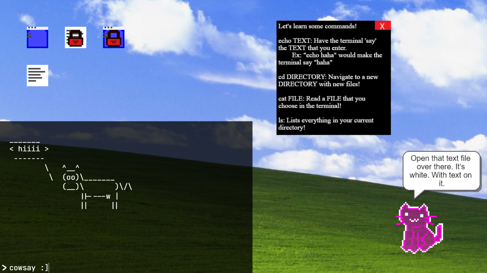

# Game Name

Terminal 0

# Team Color

Beige

# Developers

-   Blade Tyrrell (bladetyr@udel.edu)
-   Zachary England (uytyks@udel.edu)
-   Laura Lewis (belewis@udel.edu)

# Blurb

Terminal 0 is a video game dedicated to teaching users how to navigate a new operating system and investigate a system using basic cybersecurity concepts. The user will explore terminals, windows, and commands while trying to solve the mystery of the computer's origin. Terminal 0 is meant to teach the user how to interact with a real bash-based terminal and UI. The player will be guided by CAT: a program (or something...) on the computer who offers you slightly too sarcastic advice and guidance. With the help of your assistant, CAT, explore the operating system and the mysteries that lie within!

# Basic Instructions

CAT will guide you through most things, but here are some other instructions:

-   Click on the bottom of the terminal to start typing inside
-   Hit enter to submit your terminal command
-   Click on the desktop icons to open other windows
-   Click on the red X to close the windows
-   Don't rm anything you're not willing to lose.

# Screenshot

# Gameplay Video

<video src="https://drive.google.com/file/d/1sTK4Yf55PwjRNaVS4bOryQoKGtSQ_wAp/view?usp=sharing"/>

# Educational Game Design Document

Link to our [egdd](docs/egdd.md)

# Credits

-   Windows XP Background: https://www.wallpaperhub.app/wallpapers/6852
-   Locked File SFX: https://www.myinstants.com/en/instant/correct-ding/?utm_source=copy&utm_medium=share
-   Pop Sound Effect: https://pixabay.com/sound-effects/pop-39222/
-   Blip Sound Effect: https://pixabay.com/sound-effects/blip-131856/
-   Background Music: https://youtu.be/qaBlfapZB6s?si=2MIMsFTicQRiwHxZ
